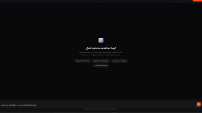
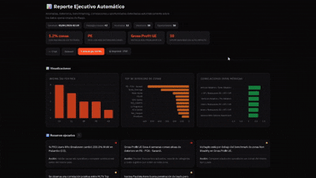

<div align="center">

<pre>
██████╗  █████╗ ██████╗ ██████╗ ██╗      ██████╗ ██████╗ ███████╗
██╔══██╗██╔══██╗██╔══██╗██╔══██╗██║     ██╔═══██╗██╔══██╗██╔════╝
██████╔╝███████║██████╔╝██████╔╝██║     ██║   ██║██████╔╝███████╗
██╔══██╗██╔══██║██╔═══╝ ██╔═══╝ ██║     ██║   ██║██╔═══╝ ╚════██║
██║  ██║██║  ██║██║     ██║     ██║     ╚██████╔╝██║     ███████║
╚═╝  ╚═╝╚═╝  ╚═╝╚═╝     ╚═╝     ╚═════╝ ╚═════╝ ╚═╝     ╚══════╝
</pre>

[](https://fastapi.tiangolo.com)
[](https://python.org)
[](https://platform.deepseek.com)
[](https://pandas.pydata.org)
[](https://docker.com)
[](LICENSE)

Chatbot conversacional que permite a cualquier persona del equipo consultar métricas operacionales en español — sin saber SQL ni Python.

</div>

---

## Demo del chatbot

<div align="center">
  
</div>
---

## Reporte de insights automático
<div align="center">
  
</div>
---

## ¿Qué es esto?

El chat-bot convierte preguntas en lenguaje natural en análisis de datos ejecutivos. Pregunta sobre **Perfect Orders**, **Lead Penetration**, **Gross Profit UE** y más — y obtén tablas, gráficos e interpretaciones fundamentadas en datos reales, al instante.

```
"¿Cuáles son las 5 zonas con menor Perfect Orders en Colombia?"
         ↓
   Análisis pandas + interpretación ejecutiva + tabla exportable
```

---

## ¿Cómo usarlo?

**Con Docker**

```bash
git clone <URL_DEL_REPO> && cd rappi-ops
cp .env.example .env   # agrega tu DEEPSEEK_API_KEY si tienes una
# coloca el Excel en data/
docker compose up --build
```

**Sin Docker**

```bash
# 1 — Clonar el repositorio
git clone <URL_DEL_REPO> && cd rappi-ops

# 2 — Crear entorno virtual e instalar dependencias
python -m venv .venv && .venv\Scripts\activate
pip install -r requirements.txt

# 3 — Configurar API key de DeepSeek (opcional)
cp .env.example .env   # edita el .env y pega tu clave

# 4 — Colocar el Excel en data/  (nombre exacto requerido por data_loader.py: Rappi Operations Analysis Dummy Data.xlsx)

# 5 — Iniciar el servidor
uvicorn main:app --reload
```

> **Abre** → [`http://127.0.0.1:8000`](http://127.0.0.1:8000)

> **Sin `DEEPSEEK_API_KEY`:** el bot funciona completamente con fallbacks determinísticos basados en pandas. No es necesaria ninguna clave para la demo básica.

---

## Rutas disponibles

| Ruta | Método | Descripción |
|------|:------:|-------------|
| `/` | `GET` | Interfaz de chat principal |
| `/excel` | `GET` | Vista previa del dataset (primeras 200 filas) |
| `/excel/download` | `GET` | Descarga el archivo Excel original |
| `/insights` | `GET` | Reporte ejecutivo automático — anomalías, tendencias y oportunidades |
| `/insights/download` | `GET` | Descarga el reporte de insights como HTML standalone |
| `/chat` | `POST` | Endpoint del chatbot — recibe `message` + `history`, devuelve respuesta estructurada |
| `/chat/stream` | `POST` | Igual que `/chat` pero con respuesta en streaming SSE |
| `/export/csv` | `POST` | Exporta el resultado de la consulta actual como CSV |
| `/docs` | `GET` | Swagger UI con documentación interactiva de la API |

---

## Casos de uso

<table>
<tr><th>Tipo de consulta</th><th>Ejemplo</th></tr>
<tr><td>Evolución temporal</td><td><em>"Muéstrame la evolución de Gross Profit UE en Facatativa las últimas 8 semanas"</em></td></tr>
<tr><td>Top N zonas</td><td><em>"¿Cuáles son las 5 zonas con menor Perfect Orders en Colombia?"</em></td></tr>
<tr><td>Promedio por país</td><td><em>"¿Cuál es el país con el promedio de Lead Penetration más alto?"</em></td></tr>
<tr><td>Crecimiento de órdenes</td><td><em>"¿Cuáles son las zonas que más crecen en órdenes en las últimas 5 semanas?"</em></td></tr>
<tr><td>Benchmarking</td><td><em>"Compara Usme contra zonas similares en Colombia"</em></td></tr>
<tr><td>Deterioro sostenido</td><td><em>"¿Qué zonas tienen 4 semanas consecutivas de caída en Perfect Orders?"</em></td></tr>
<tr><td>Recomendación ejecutiva</td><td><em>"Dame una recomendación ejecutiva basada en este análisis"</em></td></tr>
<tr><td>Anomalías WoW</td><td><em>"¿Qué zonas tuvieron el mayor cambio semana a semana?"</em></td></tr>
</table>

---

## Arquitectura

Se separaro la generación de código de la interpretación para que el LLM nunca invente números — primero pandas calcula, luego el modelo interpreta. El fallback determinístico garantiza que el bot siga respondiendo aunque la API externa falle.

```
Usuario
  └─► chat.html  (SPA vanilla JS · dark theme)
        └─► POST /chat
              └─► ChatService.answer()
                    ├─► _is_out_of_scope()           guardrail sin tokens LLM
                    ├─► Call 1 · DeepSeek            solo código Python, sin historial
                    │     └─► QueryExecutor.run_code()  → pandas  → DataFrame
                    ├─► Call 2 · DeepSeek            interpretación con datos reales + historial
                    └─► Fallback determinístico       _fallback_query() por intención

Capa de insights  (/insights)
  InsightsService
    ├─► detect_anomalies()             cambios WoW > 10%
    ├─► detect_deteriorating_trends()  4 semanas consecutivas de caída
    ├─► detect_benchmarking()          gaps vs. promedio del mismo tipo de zona
    ├─► detect_correlations()          Pearson entre métricas + pares de negocio
    └─► detect_opportunities()         alta LP + bajo PO o bajo GP
```

---

## Variables de entorno

| Variable | Descripción | Obligatoria |
|----------|-------------|:-----------:|
| `DEEPSEEK_API_KEY` | API key para el modelo `deepseek-chat`. Obtener en [platform.deepseek.com](https://platform.deepseek.com). Costo estimado: < $0.01 por sesión de demo. Sin ella, el bot usa fallbacks determinísticos. | No |

---

## Decisiones técnicas

| Decisión | Alternativa considerada | Razón |
|----------|------------------------|-------|
| **DeepSeek** como LLM | OpenAI GPT-4, Groq + Llama | ~20× más económico que GPT-4; API compatible con OpenAI SDK; rendimiento suficiente para generación de código pandas |
| **FastAPI** como backend | Flask, Streamlit | Async nativo, Swagger automático en `/docs`, validación Pydantic, mayor rendimiento |
| **Dos llamadas LLM** | Una sola llamada | Evita que el LLM invente valores antes de ver datos reales; la interpretación se basa en resultados ejecutados |
| **Fallbacks determinísticos** | Solo LLM | Si el LLM falla o tiene rate limit, el bot sigue funcionando con respuestas auditables |
| **Jinja2 templates** | HTML en f-strings | Separación entre lógica y presentación; más fácil de mantener |
| **HTML puro + vanilla JS** | React, Vue | Sin build step, sin dependencias de node; deployable como archivo estático |
| **Pandas en memoria** | PostgreSQL, DuckDB | Dataset pequeño (<10k filas); latencia mínima; sin infraestructura adicional |

---

## Mejoras para producción

Para escalar a producción se agregaría:

* **PostgreSQL** — persistencia del historial de conversaciones y auditoría de consultas
* **Redis** — caché de respuestas frecuentes para reducir costos de API
* **JWT + rate limiting** — autenticación por usuario
* **Railway / Render** — CI/CD desde GitHub con variables de entorno gestionadas
* **Fine-tuning** — entrenamiento incremental sobre queries exitosos para reducir dependencia externa


